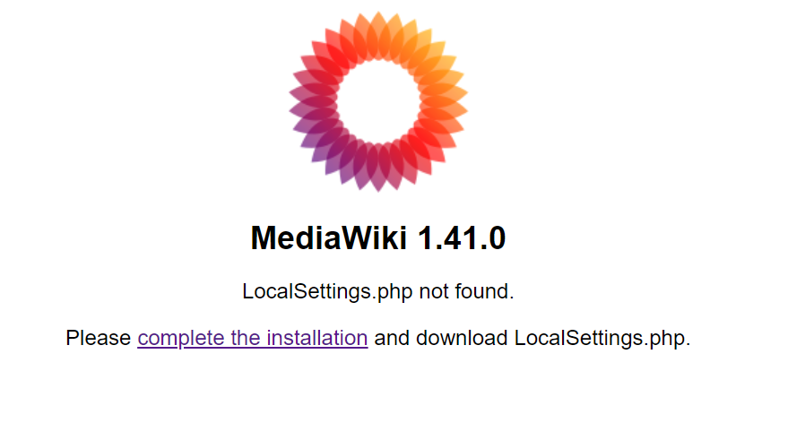

# Mediawiki

# Prerequisites
To perform all steps below you will need to have the following in place:

- Access to a [Azure Account](https://azure.microsoft.com/en-in/free) with role `Global Administrator`
- Terraform `1.7.4` or newer installed
- Kubectl installed
- Azure CLI `2.58.0` or newer installed
- Azure `subscription id`
- Ubuntu VM for Github Actions self-hosted runner
- Github [Personal Access Token](https://docs.github.com/en/enterprise-server@3.9/authentication/keeping-your-account-and-data-secure/managing-your-personal-access-tokens)
- ACR (Azure container registry)

# Bootstraping

## Step 1: Provision backend with bootstraping
### 1.1. Azure login

- Clone github repo
- Login to Azure CLI `az login` or open Azure Cloud Shell

## 1.2 Initialise the Terraform

```shell
cd mediawiki/bootstrap
# change location value in variables.tf file
terraform init
```

## 1.3 Plan the bootstrap

```shell
terraform plan
```

## 1.4 Apply the bootstrap

```shell
terraform apply
````

# Infrastructure Provisioning with Terraform & Github Actions

## Step 1: Create Azure Service Prinipal
- Login to Azure CLI `az login` or open Azure Cloud Shell
- Run the following command to create a new service principal
```
az ad sp create-for-rbac --name "myServicePrincipal" --role contributor --scopes /subscriptions/{subscription-id} --sdk-auth
```
- The command will output a JSON object containing the service principal's credentials, including the clientId and clientSecret. Save these values as you'll need them in the next step

## Step 2: Insttal Github Actions self-hosted runner if not avaulable already
- Add [self-hosted runner](https://docs.github.com/en/actions/hosting-your-own-runners/managing-self-hosted-runners/adding-self-hosted-runners)
- Configure [self-hosted runner as service](https://docs.github.com/en/actions/hosting-your-own-runners/managing-self-hosted-runners/configuring-the-self-hosted-runner-application-as-a-service)
- Install [terraform](https://developer.hashicorp.com/terraform/tutorials/aws-get-started/install-cli)
- Install [az cli](https://learn.microsoft.com/en-us/cli/azure/install-azure-cli-linux?pivots=apt)

> **BETTER WAY TO DO THIS:**  Create docker image with all cli installed and use the docker image in Github Actions to run the job on container

## Step 3: Configure your first environment

### 3.1. Create Environment

Github Environments are used to configure Vnet and AKS cluster deployment in a specific region. The name of the environment will be used as the `resource_prefix` for all resources in the account.
An environment requires the following variables and secrets at a minimum:

| Variable               | Description                                         | Example                                |
|------------------------|-----------------------------------------------------|----------------------------------------|
| `LOCATION`           | The Azure Region to deploy the Vent and AKS cluster to | `EAST US`                            |

| Secret               | Description                                         | Example                                |
|------------------------|-----------------------------------------------------|----------------------------------------|
| `ARM_CLIENT_ID`           | Client Id obtained at step 1 | `XXXXXXXXX`                            |
| `ARM_CLIENT_SECRET`           | Client Secret obtained at step 1 | `XXXXXXXXX`                            |
| `ARM_SUBSCRIPTION_ID`           | Azure subcription id | `XXXXXXXXX`                            |
| `ARM_TENANT_ID`           | Tentant Id obtained at step 1 | `XXXXXXXXX`                            |

> **BETTER WAY TO DO THIS:**  Configure a Federated Identity Credential in Azure allowing Github to Authenticate with OIDC and access Azure Resources.

### 3.2. Trigger workflow

Trigger the `Apply Cluster with Vnet` workflow. Input the name of the `environment` (e.g. `dev`) you just created. After about 5 minutes you should have a fully functional AKS cluster within its own Vnet.

# Build Pipelines

## Step 1: Setup Github Actions for build

- In your GitHub repository, go to Settings > Secrets > Actions
- Create the following secrets and variable:

| Variable               | Description                                         | Example                                |
|------------------------|-----------------------------------------------------|----------------------------------------|
| `REGISTRY_LOGIN_SERVER`           | Registry server | `myregistry.azurecr.io`                            |

| Secret               | Description                                         | Example                                |
|------------------------|-----------------------------------------------------|----------------------------------------|
| `AZURE_CREDENTIALS`           | Admin Cred or Cred obtained at step 1 | {\"clientId\": \"<clientId>\", \"clientSecret\": \"<clientSecret>\", \"subscriptionId\": \"<subscriptionId>\", \"tenantId\": \"<tenantId>\"}                            |

## Step 2: Trigger build
- Change anything on the Dockerfile build will trigger automatically, docker image will be crated and pushed to ECR
- Note the docker image name to be used in deployment


# Application Deployment

## Step 1: Clone repo and login to kubernetes
```bash
git clone https://github.com/SamitManna/mediawiki.git
az login
az aks get-credentials --resource-group <env>-rg --name <env>-cluster
```

## Step 2: Randomize secrets
```bash
cd mediawiki/deployment/
bash random_password_secret.sh
```

## Step 3: Apply Kubernetes
```bash``
cd kustomize-mediawiki/overlays/development/
kubectl apply --kustomize .
```

> **BETTER WAY TO DO THIS:**  Setup argocd in AKS cluster and deploy as GitOps

## Step 4: Verify Deployment
- Verify if pods and services are ready
```bash
kubectl get pods
kubectl get svc
```
- Note the `EXTERNAL-IP` of `mediawiki` service
- Open browser and enter `http://EXTERNAL-IP`
- Landing page will open


## Step 5: Complete Installation

> **IDEAL WAY TO DO THIS:**  It should be done with init containers. One init container in mariadm deployment to create users, permission in mariadb. Another init script to generate LocalSettings.php using install.php. Need to troubleshoot this, below is the workaround.

- Click on complete the installation
- Once installation complete download the LocalSettings.php
- Copy the file currect folder
- Upload the mediawiki kubernetes pod
```bash
kubectl get pods -l app=mediawiki
# note pod name
kubectl cp LocalSettings.php mediawiki-dc4d4d576-plsvd:/var/www/html/LocalSettings.php
```
- Now click on enter wiki on browser to open newly created wiki

# Scaling Considerations (Optional):
